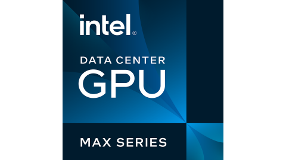
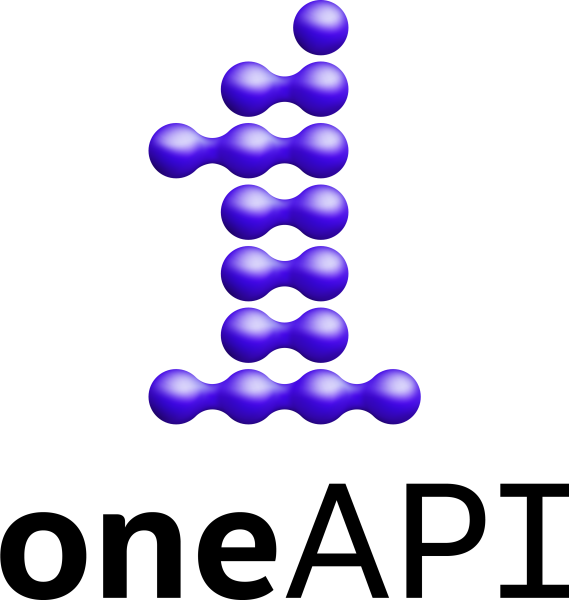

## Summary

This event will follow on from the [SYCL practitioners
hackathon](https://scicomp.webspace.durham.ac.uk/events/code_performance_series/sycl-practitioners-hackathon-2022-user-group-meeting/)
hosted in Durham In November 2022. We are hosting in Cambridge so that it is
convenient for those attending [IWOCL/SYCLcon 2023](https://www.iwocl.org/)
which takes place over the following three days.

This will be a one-day hands-on hackathon. Given the limited time, we will focus
on working with an open source benchmarks project that will help both learning
for attendees and also benefit the overall SYCL community. Teams will work on
adding to and enhancing the project. There will be also be the opportunity to
chat with SYCL experts and other members of the community to discuss code,
issues, SYCL features and general queries.

Participants are not required to bring along their own SYCL code but some basic
familiarity with SYCL will be assumed (e.g. at the level of the material covered
in the [Intel Essentials of SYCL
modules](https://www.intel.com/content/www/us/en/developer/tools/oneapi/training/dpc-essentials.html)).
Furthermore, participants will be expected to live-code throughout the hackathon
and will therefore need to bring along a laptop with which they can access the
remote system and program on.
## SYCL benchmark codes

The [HeCBench](https://github.com/zjin-lcf/HeCBench) project contains an
extensive set of benchmarks written in CUDA, HIP and SYCL. There are also
numerous papers using the results of these benchmarks that have been published.
Some gaps exist in the implementations for the project, and it would be useful
to examine some of the benchmark performance results to understand what
optimizations can be used.

## Registration

Please complete the [registration form](register) by 

<strong> midnight on Thursday 6 April. </strong>

Note that there is limited capacity and that priority will be given to
participants from Intel oneAPI Centers of Excellence, ExCALIBUR and local
participants.

## Logistical details

* Timings: 09:00 - 18:00 UTC, Mon 17 Apr 2023
* Location: Centre for Mathematical Sciences, University of Cambridge, Wilberforce Road, Cambridge, CB3 0WA, UK 

    <iframe scrolling="no" marginheight="10" marginwidth="10" src="https://maps.google.com/maps?width=720&amp;height=600&amp;hl=en&amp;q=Centre%20for%20Mathematical%20Sciences,%20Wilberforce%20Road,%20Cambridge,%20CB3%200WA+(Centre%20for%20Mathematical%20Sciences)&amp;t=&amp;z=15&amp;ie=UTF8&amp;iwloc=B&amp;output=embed" width="100%" height="400" frameborder="0">
    </iframe>

## Agenda

The following is preliminary.

| Time | Activity | Lead |
| --- | --- | --- |
| 09:00-09:30 | Arrival | - |
| 09:30-09:45 | Introduction to hackathon | Jay Mahalingham (Intel, remote) |
| 09:45-10:00 | Introduction to HeCBench project and hackathon themes | Rod Burns (Codeplay), Hugh Delaney (Codeplay) |
| 10:00-10:15 | Introduction to CSD3 | Kacper Kornet (Cambridge) |
| 10:15-10:30 | Introduction to Ponte Vecchio on the Intel DevCloud | Hugh Delaney (Codeplay) |
| 10:45-11:30 | Hands-on | - |
| 11:30-11:45 | Coffee break | - |
| 11:45-13:00 | Hands-on | - |
| 13:00-14:00 | Lunch | - |
| 14:00-15:45 | Hands-on/own SYCL code discussion | - |
| 15:45-16:00 | Coffee break | - |
| 16:00-17:45 | Hands-on/own SYCL code discussion | - |
| 17:45-18:00 | Wrap-up and close | Rod Burns (Codeplay), Miren Radia (Cambridge) |

## Travel and accommodation

If you are arriving by rail, there is a direct bus link from Cambridge [central]
station to a stop that is very close to the Centre for Mathematical Sciences
(CMS) which runs approximately every 15 minutes. For more details see
[here](https://www.environment.admin.cam.ac.uk/travel/travel-bus).

If you are booking accommodation for both this hackathon and IWOCL/SYCLcon, the
CMS is approximately a 20-minute walk from Sidney Sussex College (where
IWOCL/SYCLcon is taking place)/the town centre.

## HPC system

In order to streamline setup, we would prefer participants to use the [Cambridge
Service for Data Driven Discovery
(CSD3)](https://www.hpc.cam.ac.uk/high-performance-computing) system for this
hackathon. 

In particular we will be using the
[Wilkes3](https://www.hpc.cam.ac.uk/systems/wilkes-2) part of this system which
features 80 nodes each with

* 2x AMD EPYC 7763 64-Core Processor 1.8GHz (128 cores in total)
* 1000 GiB RAM
* 4x NVIDIA A100-SXM-80GB GPUs
* Dual-rail Mellanox HDR200 InfiniBand interconnect

If you do not have an account on CSD3, please indicate on the registration form.
If you do have an account, please provide your username so that it can be added
to the reservation.

In addition to CSD3, attendees will have the opportunity to use a system with
the new Intel Data Center GPU Max (aka Ponte Vecchio) on the Intel DevCloud 
during the hackathon.

    

## Support

This event is being organised in collaboration between the two [oneAPI Centers
of
Excellence](https://www.intel.com/content/www/us/en/developer/tools/oneapi/training/academic-program/centers-of-excellence.html)
at the University of Cambridge: 
* [The Stephen Hawking Centre for Theoretical Cosmology](https://www.ctc.cam.ac.uk/)
* [The Cambridge Open Zettascale Lab](https://www.zettascale.hpc.cam.ac.uk/)

    

We are grateful to the support provided by Intel and Codeplay for this event.

    
    

